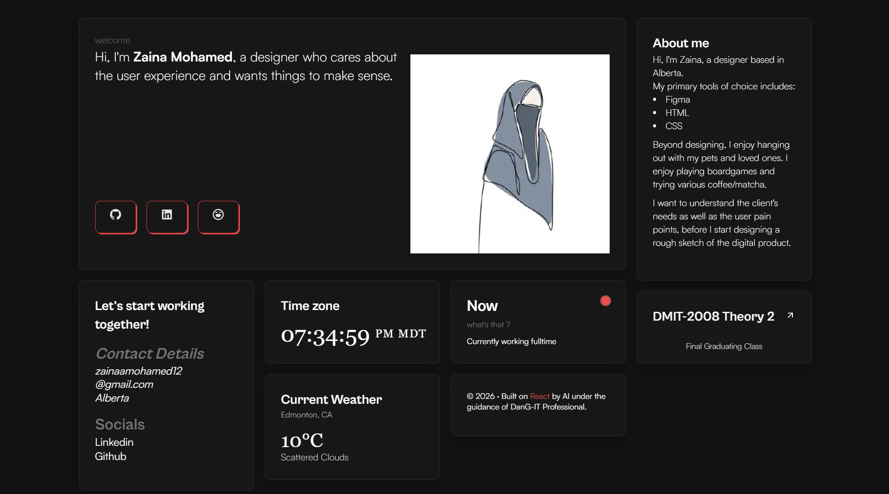
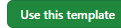
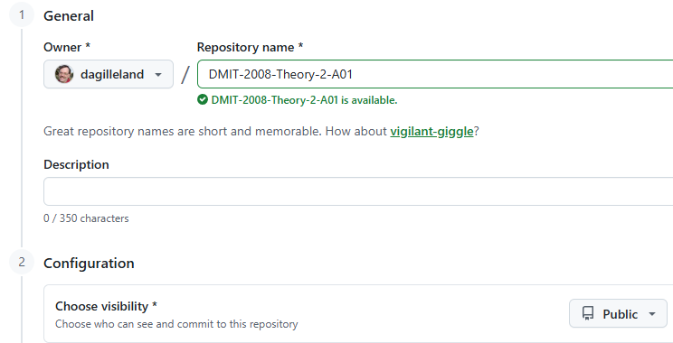
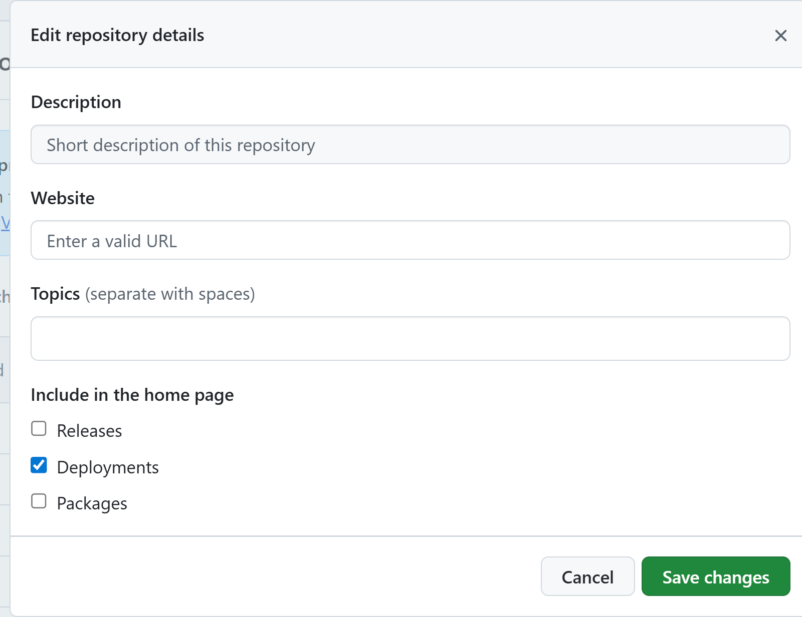
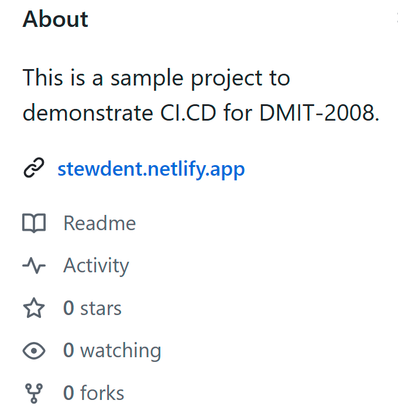

# Theory 2

> Student Name: **YOUR_NAME**

In this assignment, you will demonstrate your ability to

- 💫 Implement application testing using test-driven development techniques
- 💫 Compose an efficient automated development workflow
- 💫 Connect a user interface with data retrieved from a web service
- 💫 Prepare a single-page application for production deployment

#### Assignment Specs

22 points - 7.5% of your final mark

## Overview

This repo is a sample design for a personal portfolio website. Originally created for [Astro](https://astro.build), this version has been adapted to React/NextJS.

<!-- 
- Protection of an API key in a `.env` folder
- Set up environment variables for Production
- API Endpoint for delivering JSON on a GET request (similar to `api/hello.js`) 
- CI/CD Processes
- Unit Testing
- Modern React (no NextJS)
- Versioning (`pnpm version patch`)
-->

----

## Project Setup

> ***Note:** Because this project involves granting a third-party service access to your repository, you will be expected to store this assignment on your own GitHub user account. In order for this to be markable by your instructor, you will need to ensure it is a **public** repository on your account.*

To accept this assignment, you must create a copy of this repo via the "Use this template" button on the public source repository.

When creating your copy, ensure it is on your own GitHub user account and that it is public. For example, if your GitHub username is `dagilleland`, you would create it as shown in this image.

## **(3 Marks)** - Deploy to Netlify

If you have not yet done so, create an account on Netlify. Deploy your copy of this project and use your GitHub username as the subdomain of the published site. For example, if your GitHub username is `stew-dent`, then your site should be publically visible at [`stew-dent.netlify.app`](https://stew-dent.netlify.app). (If that URL is not available, use something close/similar.)

## **(1 Mark)** - Update Dependencies

You will need to examine your project for outdated dependencies and perform the appropriate updates. After updating your dependencies, increase the patch version of your own project: `npm version patch`.

> *📍 Make sure to do a commit and push of your code changes at this point.*
>
> *Also, ensure that when you are pushing updates, those are flowing through to your Netlify deployment.*

## **(3 Marks)** - Customize the `profile.json`

The content on the portfolio site references details for the original designer (). All of this content is stored in the [`profile.json` file](./docs/ProfileEditing.md). Edit the contents of this file to reflect your own information. The sections you are to update are:

- [SEO Metadata](./docs/ProfileEditing.md#seo)
- [Intro Card](./docs/ProfileEditing.md#intro)
- [About](./docs/ProfileEditing.md#about)
- [Contacts](./docs/ProfileEditing.md#contacts)
- [Site Metadata](./docs/ProfileEditing.md#site), specifically the `title` and `description`.

When you have completed the customization to your personal information, do another version bump of your project: `npm version patch`.

> *📍 Make sure to do a commit and push of your code changes at this point.*

## **(2 Marks)** - Add a JSON API Endpoint

Add a **`pages/api/about.js`** endpoint to provide the `"about"` portion of your `profile.json` information. Do another version bump: `npm version patch`. For an example of how to do this, see the [`pages/api/hello.js`](./src/pages/api/hello.js) file.

> *📍 Make sure to do a commit and push of your code changes at this point.*

## **(10 Marks)** - Weather Information

A placeholder card has been included in `index.js`. You must replace this with a `WeatherCard` component which uses the [OpenWeatherMap](https://openweathermap.org) API. Your creation of this component is to include unit tests. All the major code portions are provided for you as images that you must hand-code into your project.

1. Follow the instructions to [manage your API key](./docs/WeatherSetup.md) for consuming/using the weather service.
1. Add the following dependencies and scripts to your project:
    - Dev Dependencies:
        - `jsdom`
        - `msw`
        - `vite`
        - `vitest`
        - `@testing-library/jest-dom`
        - `@testing-library/react`
        - `@vitejs/plugin-react`
    - New Scripts:
        - `"test": "vitest run"`
        - `"test:watch": "vitest"`
1. Follow [these instructions](./docs/WeatherCardComponent.md) to create the functioning component, complete with unit tests.
1. Follow [these instructions](https://docs.netlify.com/build/environment-variables/overview/) for setting up your API key on your Netlify deployment.
1. Update your project's **minor** version number: `npm version minor`.

> *📍 Make sure to do a commit and push of your code changes at this point.*

## **(2 Marks)** - Update the `ReadMe.md`

Update this `ReadMe.md` with the following information at the top:

- Your full name as well as your GitHub username
- A screenshot of your deployed website in its final form

## **(1 Mark)** - Update Repository Details 

Edit the Repository Details (click the "About" gear icon) so that it includes a short description of your project and a link to the Netlify URL of your deployed site.

| Edit Repository Details                  | Sample Result                     |
| ---------------------------------------- | --------------------------------- |
|  |  |

## Final Submission

In Brightspace, submit the URL for your website and your GitHub repository. Remember, your GitHub repository must be **public** in order to be graded.

## Grading Rubric

A **minimum** of 5 commits (including the initial one for creating the repo) are required for this assignment. The commits must align with the steps noted in these specs. Insufficient commits may result in a deduction of up to 5 marks from the total.

| Step                     | Weight |  Earned   |
| ------------------------ | :----: | :-------: |
| Deploy to Netlify        |   3    |  **tbd**  |
| Update Dependencies      |   1    |  **tbd**  |
| Customize `profile.json` |   3    |  **tbd**  |
| JSON API Endpoint        |   2    |  **tbd**  |
| Weather Information Card |   10   |  **tbd**  |
| Update ReadMe            |   2    |  **tbd**  |
| GitHub Repository        |   1    |  **tbd**  |
| *Penalties: up to -5*    |  (-5)  |           |
| **Total**                |  *22*  | ***TBD*** |
