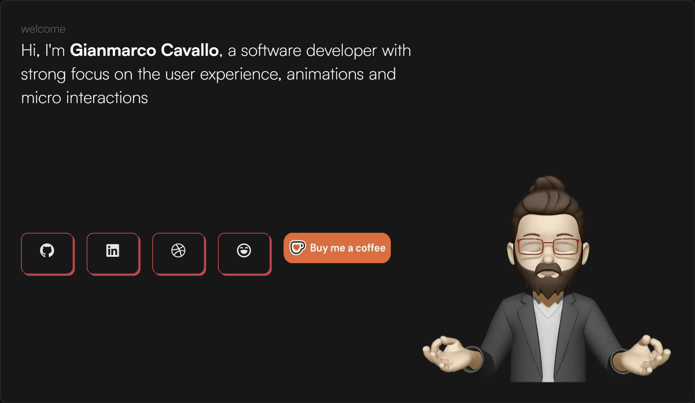
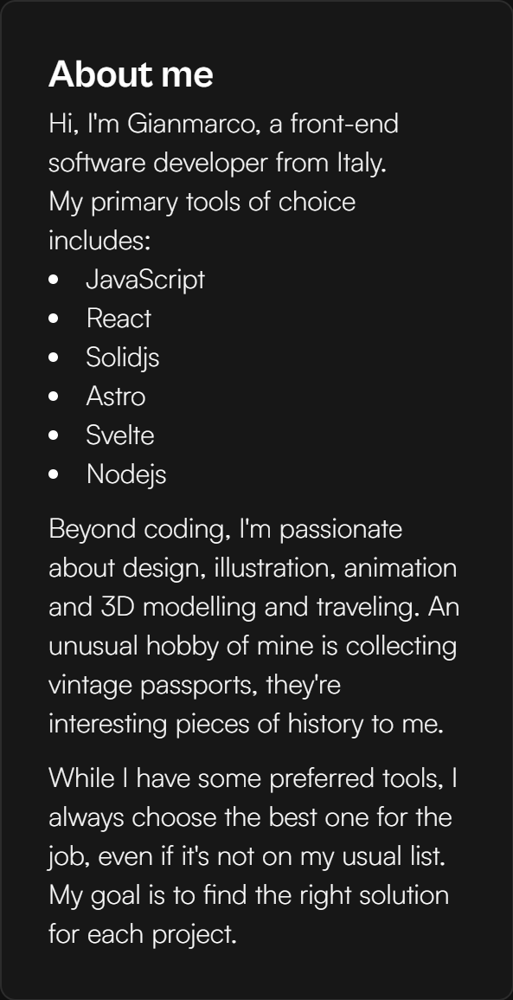
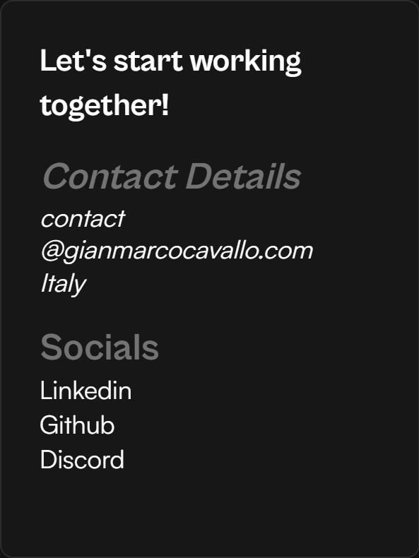

# Profile Editing

This project reads profile content from `~/src/data/profile.json`.

## File Overview

Top-level sections in `profile.json`:

- `site`: Page title, description, and footer text.
- `seo`: Structured data (JSON-LD) values used for search engines and social previews.
- `intro`: Hero card content (name, summary, social icon buttons, support link, image).
- `about`: "About me" card text and tool list.
- `contacts`: Contact card text, email, location, and plain text social links.
- `timeZone`: Live clock card title and IANA timezone.
- `now`: "Now" card title, helper link, and current status text.
- `sections`: Extra cards (`schoolAssignment` link card and `comingSoon` placeholder card).

## Section Details

### `site`

Controls site-wide metadata and footer line.

- `title`: Browser/page title.
- `description`: Meta description used by layout and SEO tags.
- `footer.year`: Footer year text.
- `footer.prefix`: Footer text before framework link (example: `Built on`).
- `footer.frameworkName`: Footer linked framework name.
- `footer.frameworkUrl`: Footer framework link URL.
- `footer.author`: Footer author credit text.

### `seo`

Used in structured metadata in `BasicLayout`.

- `personName`: Primary person name.
- `jobTitle`: Job title text.
- `worksFor`: Organization or employment context.
- `location`: City/region locality.
- `countryCode`: Country code (example: `CA`, `US`, `IT`).
- `nationality`: Nationality label.
- `publisherName`: Publisher/brand name for metadata.
- `sameAs`: Array of canonical profile URLs (LinkedIn, GitHub, etc.).

### `intro`

Controls the large top intro card. Also refer to the [Social Buttons](#introsocialbuttons-object-shape).

- `welcomeLabel`: Small heading (example: `welcome`).
- `name`: Display name in intro sentence.
- `summary`: Short role/description sentence continuation.
- `socialButtons`: Icon button list (see icon values below).
- `supportLink.url`: URL for support button/link.
- `supportLink.imageSrc`: Remote/local image source for support badge.
- `supportLink.imageAlt`: Accessible alt text for support badge image.
- `image.src`: Intro portrait/image path.
- `image.alt`: Intro image alt text.



#### `intro.socialButtons` object shape

Each item:

- `ariaLabel`: Accessible label for the button/link.
- `screenReaderLabel`: Hidden text read by screen readers.
- `icon`: Icon key string (must exist in `Icon.js` map).
- `url`: External profile URL.

Supported social icon values from `~/src/components/Icon.js`:

- `ri:github-fill` - GitHub
- `ri:linkedin-box-fill` - LinkedIn
- `ri:dribbble-fill` - Dribbble
- `ri:discord-fill` - Discord
- `ri:twitter-fill` - Twitter (classic bird logo)
- `ri:twitter-x-fill` - X (Twitter/X rebrand logo)
- `ri:bluesky-fill` - Bluesky

Example:

```json
{
  "ariaLabel": "x profile",
  "screenReaderLabel": "X Profile",
  "icon": "ri:twitter-x-fill",
  "url": "https://x.com/your-handle"
}
```

### `about`

Controls the "About me" card.

- `title`: Card title.
- `intro`: Opening paragraph.
- `toolsIntro`: Short line before list of tools.
- `tools`: Array of tool names rendered as bullet points.
- `passion`: Paragraph about interests.
- `approach`: Paragraph about working style.



### `contacts`

Controls the contact card.

- `title`: Card heading.
- `contactDetailsTitle`: Label for contact details section.
- `email`: Contact email (rendered split at `@` for layout).
- `location`: Location text.
- `socialsTitle`: Label for social links list.
- `socialLinks`: Array of text links:
  - `label`: Link text.
  - `url`: External URL.



### `timeZone`

Controls the live clock card.

- `title`: Card title.
- `zone`: IANA timezone string (example: `America/Edmonton`, `Europe/Rome`).

### `now`

Controls the "Now" status card.

- `title`: Card title.
- `helpLabel`: Text for the help/reference link.
- `helpUrl`: URL for the help/reference link.
- `status`: Current short status message.

### `sections`

Controls two extra cards shown on the home grid.

- `schoolAssignment.title`: Clickable card title.
- `schoolAssignment.href`: Link URL.
- `schoolAssignment.target`: Link target (usually `_blank`).
- `schoolAssignment.placeholder`: Body text inside that card.
- `comingSoon.title`: Placeholder card title.
- `comingSoon.message`: Placeholder message text.
- `comingSoon.cta`: Placeholder call-to-action text.

## Editing Tips

- Keep URLs absolute (`https://...`) for external links.
- Keep `timeZone.zone` in valid IANA format.
- If an icon key is not mapped in `Icon.js`, the button will not render and a console warning appears.
